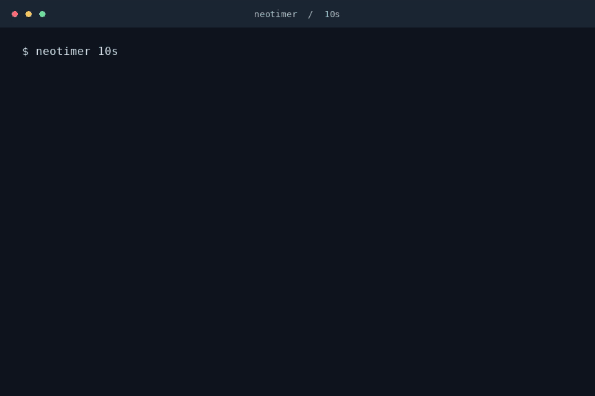

# neotimer

A small, native Linux terminal countdown with bold block digits, cyan accents, and a progress bar.
Written in C, with no third-party library dependencies.

## Demo



A ten-second countdown with pause and resume, recorded in real time.
[Download the video (MP4)](docs/demo.mp4?raw=true).

## Install

### Requirements

- Linux, a C11 compiler (such as GCC or Clang), and Make.
- Git to clone the repository.
- Optional: `notify-send` and a running desktop notification service for completion notifications.
- Optional: Python 3 to run the integration tests.

On Debian or Ubuntu, install the build tools with:

```sh
sudo apt update
sudo apt install build-essential git
```

For desktop notifications and tests, respectively:

```sh
sudo apt install libnotify-bin python3
```

On other Linux distributions, install the equivalent packages using your package manager.

### Build from source

```sh
git clone https://github.com/nunziatodamino/neotimer.git
cd neotimer
make
make install
```

This installs the executable to `~/.local/bin/neotimer` without requiring `sudo`.
Make sure that directory is on your PATH:

```sh
export PATH="$HOME/.local/bin:$PATH"
neotimer --help
neotimer 45m
```

To keep the PATH change across sessions, add the `export` line to `~/.bashrc`
for Bash or `~/.zshrc` for Zsh, then open a new terminal. Other shells may use different syntax.

You can also run the executable directly without installing it:

```sh
./build/neotimer 45m
```

### System-wide or custom installation

To install for all users under `/usr/local/bin`, build as your normal user and
use `sudo` only for installation:

```sh
make
sudo make install PREFIX=/usr/local
```

For another location, use `make install PREFIX=/your/prefix`; the executable goes
in `/your/prefix/bin`. `BINDIR` overrides the binary directory, and `DESTDIR`
adds a staging root for packaging.

## Usage

```sh
neotimer 45m
neotimer 30s
neotimer 2h
neotimer 1h 40m
neotimer 1h40m30s
```

The display follows the remaining time: `01:00:00` becomes `59:59`, then `59`, and finally `00`.
It recenters when the format or terminal size changes, with a compact layout for small windows.
The large digits use solid blocks in UTF-8 terminals, with thick ASCII strokes in other locales.

| Key | Action |
| --- | --- |
| Space | Pause or resume |
| Esc | Exit |
| Ctrl+C | Cancel |

The previous terminal screen and settings are restored on exit.

Run `neotimer --help` for a quick reference. To disable colors for a countdown:

```sh
NO_COLOR=1 neotimer 25m
```

## Update

From your cloned repository, pull the latest changes and reinstall:

```sh
git pull --ff-only
make
make install
```

Use the same installation prefix as before (for example,
`sudo make install PREFIX=/usr/local` for a system-wide installation).

## Uninstall

From the cloned repository:

```sh
make uninstall
```

For a system-wide installation, use `sudo make uninstall PREFIX=/usr/local`.
For a custom installation, pass the same `PREFIX` or `BINDIR` used to install.
If you no longer have the source checkout, remove the installed executable directly;
for the default installation:

```sh
rm "$HOME/.local/bin/neotimer"
```

neotimer does not create configuration files or save timer history.

## Behavior

- Supply integer components immediately followed by lowercase `s`, `m`, or `h`.
  Combine them with or without spaces: `1h 40m`, `1h40m`, and `"1h 40m"` all mean 100 minutes.
  Components are added together, in any order, including repeated units.
  Zero components are allowed when the total is positive; fractions and negatives are rejected.
  The maximum duration is 9,223,372,036 seconds (or the largest whole minutes/hours within that limit).
- Timing uses a monotonic clock and excludes paused time. The event loop sleeps between updates.
- At completion, a message is printed and an optional desktop notification is sent using `notify-send`.
  No terminal bell is emitted. A silent hint is sent to the desktop notification service;
  the desktop ultimately determines sound behavior. Missing or failed notifications do not fail the timer.
- Set `NO_COLOR=1` to disable colors. When input/output is redirected, `TERM` is unset, or
  `TERM=dumb`, the timer prints start and completion messages without animation or keyboard controls.
- Exit status: `0` for completion or Esc, `2` for invalid arguments, `1` for internal errors,
  and `128 + signal number` for handled termination signals (for example, `130` for Ctrl+C).

## Troubleshooting

- **`neotimer: command not found`:** add your installation's `bin` directory to
  PATH as shown above, or run `~/.local/bin/neotimer` directly for the default installation.
- **No desktop notification:** check that `notify-send` is installed and that you
  are running in a desktop session with a notification service. The countdown
  still works without it, including over SSH.
- **ASCII digits instead of solid blocks:** use a UTF-8 locale and a terminal
  font that includes the block character. Run `locale charmap` to check your locale.
- **Small digits or no animation:** enlarge the terminal for the large layout.
  Animation requires both input and output to be connected to a terminal and a
  usable `TERM` value.

## Development and contributions

Build and run the C unit tests and Python integration tests:

```sh
make test
```

The integration tests exercise the executable using pipes and pseudo-terminals,
including pause/resume, terminal cleanup, resizing, and notifications. Python 3
is required; no additional Python packages are needed.

To rebuild with another compiler or compiler flags, clean the previous build first:

```sh
make clean
make CC=clang CFLAGS='-O0 -g'
make test CC=clang CFLAGS='-O0 -g'
```

Bug reports and pull requests are welcome on
[GitHub](https://github.com/nunziatodamino/neotimer). When reporting a bug, include
the command you ran, expected and actual behavior, Linux distribution, terminal,
and any relevant output. Run `make test` before submitting code changes.

## License

[MIT](LICENSE).
